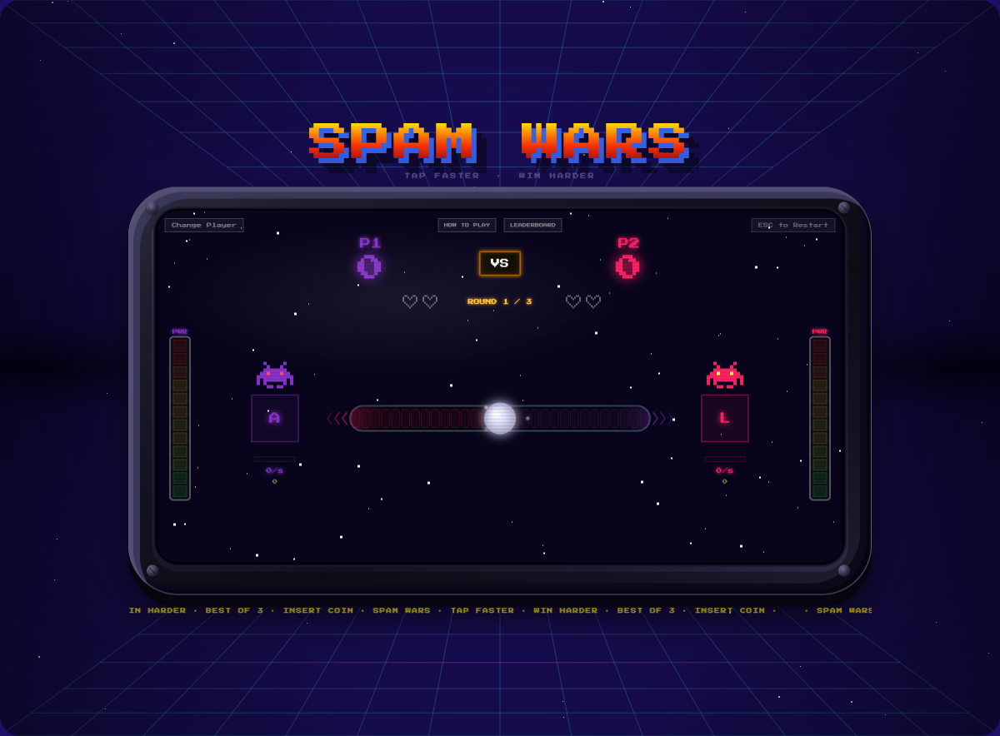

# Spam Wars

A 2-player browser tapping game. Player 1 taps `A`, Player 2 taps `L`. Push the orb to your opponent's side to win the round. First to 2 rounds wins the match.

**16 selectable alien characters · 3 power-up types · Retro chiptune audio · Mobile touch support**



---

## Play

No account or install needed — open in a browser:

```bash
npm run dev
# → http://localhost:5173
```

The original single-file version is always available at `http://localhost:5173/reference.html`.

---

## Controls

| Action | Player 1 | Player 2 |
|---|---|---|
| Tap | `A` | `L` |
| Cycle alien (prev/next) | `A` / `S` | `L` / `K` |
| Confirm / Start | `Space` | — |
| ESC to lobby | `Esc` | — |

Touch zones work on mobile — left half = P1, right half = P2.

---

## Development

```bash
npm install       # install dependencies
npm run dev       # dev server with hot reload
npm run build     # production build → dist/
npm test          # 49 unit tests
```

---

## Project structure

```
src/
├── main.ts                    # Entry point — RAF loop + input wiring
├── canvas.ts                  # Canvas setup (820×420, HiDPI)
├── constants.ts               # Game tuning constants
├── state/
│   ├── GameState.ts           # State shape + initGameState()
│   └── PhaseController.ts     # Countdown + roundEnd timing
├── modes/
│   ├── GameMode.ts            # Abstract base — add new modes here
│   ├── ModeRegistry.ts        # Registry for game modes
│   └── TugOfWarMode.ts        # Current mode: push-the-orb
├── transport/
│   ├── Transport.ts           # Abstract base — add remote play here
│   ├── LocalTransport.ts      # Same-tab default transport
│   └── PartyKitTransport.ts   # Stub: fill in for remote multiplayer
├── theme/
│   ├── Theme.ts               # Theme type schema
│   ├── ThemeManager.ts        # Runtime theme loader
│   └── themes/retro.theme.json  # All colors, sprites, audio params
├── input/
│   ├── InputBus.ts            # Decoupled event bus
│   ├── KeyboardInput.ts
│   ├── MouseInput.ts
│   └── TouchInput.ts
├── renderer/
│   ├── Renderer.ts            # Draw compositor
│   ├── DrawBoot.ts
│   ├── DrawBackground.ts
│   ├── DrawHUD.ts
│   ├── DrawPlayers.ts
│   ├── DrawOverlays.ts
│   ├── DrawScreens.ts
│   ├── DrawUIChrome.ts
│   └── CanvasUtils.ts
├── audio/
│   ├── AudioEngine.ts
│   └── ChiptuneAudio.ts
├── vfx/
│   ├── Particles.ts
│   ├── ScreenEffects.ts
│   ├── FloatTexts.ts
│   └── ScorePop.ts
├── sprites/AlienSprites.ts
├── rhythm/RhythmTracker.ts
├── powerups/PowerUpSystem.ts
├── storage/StorageManager.ts
├── mobile/MobileScale.ts
└── words/
    ├── WordList.ts            # Word list loader for future WPM mode
    └── lists/
        ├── easy.json
        ├── medium.json
        └── hard.json
```

---

## Extending the game

### New theme

Create a JSON file matching `src/theme/Theme.ts` and load it:

```typescript
import { themeManager } from './src/theme/ThemeManager.ts';
import myTheme from './my-theme.json';

themeManager.load(myTheme);
```

All colors, alien sprites, audio pitch, and star density are driven by the theme — no code changes needed.

### New game mode

```typescript
import { GameMode } from './src/modes/GameMode.ts';
import { modeRegistry } from './src/modes/ModeRegistry.ts';

class TimedClickMode extends GameMode {
  id = 'timed-click';
  label = 'Timed Click';
  defaultConfig = { timeLimit: 10 };

  init(state, config) { /* reset round state */ }
  tick(state, dt)     { /* return { won: 1|2|0|null, events: [] } */ }
  onInput(state, player, type) { /* handle tap/key */ }
  serialize()         { return {}; }
  deserialize(data)   { }
  getHudData(state)   { return {}; }
}

modeRegistry.register(TimedClickMode);
```

### Remote multiplayer

Fill in `src/transport/PartyKitTransport.ts` — the file has step-by-step instructions. The receive path (`transport message → InputBus → game loop`) is already wired.

---

## Architecture

This project was migrated from a monolithic `index.html` (~2566 lines) to a modular Vite + TypeScript codebase across 5 phases. Migration docs are in `docs/migration/`.

The three extensibility contracts:

| Contract | File | Purpose |
|---|---|---|
| `GameMode` | `src/modes/GameMode.ts` | Drop-in game rule sets |
| `Transport` | `src/transport/Transport.ts` | Local or remote input delivery |
| `Theme` | `src/theme/Theme.ts` | Full visual + audio customization |

---

## Reference

`public/reference.html` is the preserved original single-file game. It's always accessible at `/reference.html` during development and is never modified.
